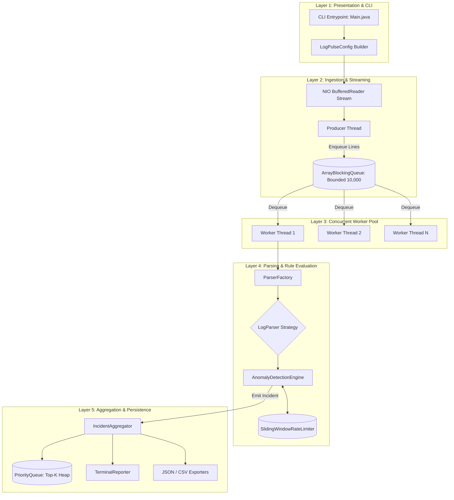
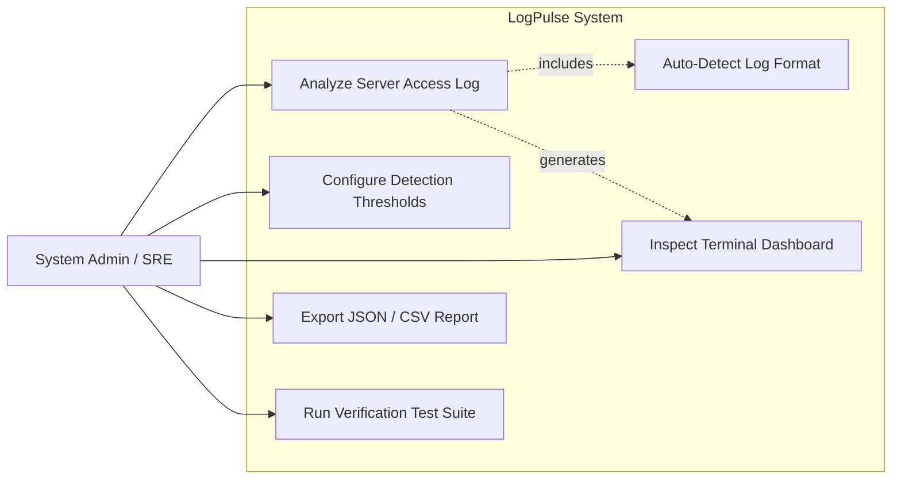
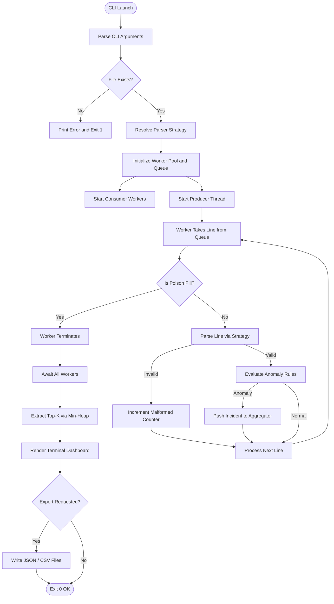
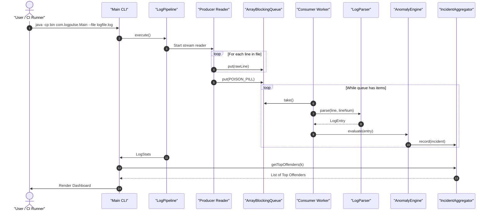
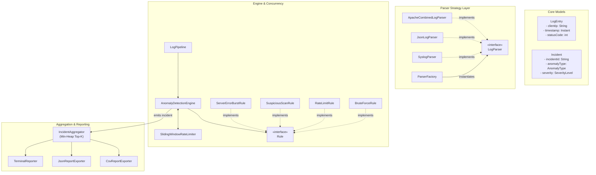
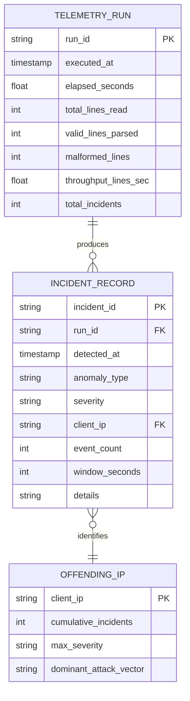

# PROJECT REPORT: LogPulse — Multi-Threaded Server Log Anomaly & Rate Limiter Engine

---

## 1. Cover Page

* **Project Title**: LogPulse: High-Throughput Multi-Threaded Server Log Anomaly & Rate Limiter Engine
* **Course Title**: Programming in Java
* **Academic Component**: Evaluated Course Project (Flipped Course Evaluation)
* **Institution**: VIT Bhopal University — School of Computing Science and Engineering
* **Platform**: VITyarthi Learning Destination
* **Submission Date**: September 2026
* **Language & Runtime**: Java SE 17+ (JDK 26 Verified)
* **Author**: Dhrrishit V Deka
* **Contact Email**: n9yyk6uuu@mozmail.com

---

## 2. Introduction

Modern digital services rely on web servers (such as Nginx, Apache HTTP Server), API gateways (Envoy, Kong, AWS API Gateway), and cloud microservices to handle millions of user interactions daily. Every HTTP interaction produces an immutable access log line capturing key transaction metadata: timestamp, remote client IP address, HTTP method, requested URI endpoint, response status code, byte payload size, and latency.

While access logs are the primary telemetry source for infrastructure observability, analyzing them efficiently presents severe systems engineering challenges:
1. **Security Vulnerability Detection Lag**: Malicious activities such as credential stuffing (brute-force authentication), aggressive web scraping, DoS floods, and endpoint reconnaissance (probing for vulnerable admin panels or secret environment files) occur in rapid bursts. By the time central logging platforms ingest and index the data, attacks may have succeeded.
2. **Resource Constraints in Local & CI/CD Environments**: Commercial security information and event management (SIEM) platforms (Splunk, Datadog, ELK stack) are resource-intensive, requiring multi-node clusters and gigabytes of memory. Developers and DevOps engineers investigating live incidents or executing regression tests in CI/CD containers require a fast, lightweight, self-contained CLI utility capable of streaming gigabytes of logs on a single node without causing `OutOfMemoryError` (OOM).

**LogPulse** was designed and implemented to address these challenges. Developed in pure Java, LogPulse is a multi-threaded, memory-bounded command-line log analysis engine. It leverages core computer science concepts—including the **Producer-Consumer pattern**, **lock striping**, **sliding-window timestamp queues**, and **Heap-based Top-K tracking**—to deliver high-throughput log parsing, real-time intrusion anomaly detection, and automated SIEM-compliant audit reporting.

---

## 3. Problem Statement

To design, develop, and benchmark an automated, multi-threaded server access log analysis engine in Java that:
* Ingests high-volume web access logs in heterogeneous formats (Apache Combined Log, Nginx, JSON, and Syslog) without exceeding a fixed memory footprint.
* Processes log records concurrently across multi-core CPUs while preserving thread safety and avoiding race conditions.
* Evaluates sliding-window rate limits and security anomaly rules in real time to detect brute-force attacks, request bursts, error surges, and vulnerability probes.
* Ranks top offending entities algorithmically and provides deterministic, structured CLI outputs and machine-readable audit reports (JSON/CSV) without any graphical interface dependencies.

---

## 4. Functional Requirements

In accordance with Section 2.1 of the project guidelines, LogPulse is organized into three major functional modules:

### Module 1: Log Ingestion & Stream Parsing Module (FR-1)
* **FR-1.1 Format Strategy Resolution**: The engine must support multiple standard server log formats (Apache Combined Log Format, Cloud JSON Microservice Logs, and RFC 5424/3164 Syslog). It must allow manual selection via CLI flag `--format` or automatic detection based on sample line sniffing.
* **FR-1.2 Streaming File Ingestion**: The system must stream files of arbitrary size (from kilobytes to gigabytes) line-by-line using buffered NIO channels without loading the full file into main memory.
* **FR-1.3 Token Extraction & Validation**: Each raw line must be tokenized into an immutable domain object (`LogEntry`), validating fields including Client IP, Timestamp, HTTP Method, Endpoint URI, Status Code, Bytes Sent, Response Latency, and User Agent.

### Module 2: Concurrency & Anomaly Detection Rule Engine (FR-2)
* **FR-2.1 Multi-Threaded Dispatch**: Raw log lines must be dispatched to a worker thread pool (`ExecutorService`) using a bounded queue (`ArrayBlockingQueue`) to parallelize token parsing and rule evaluation.
* **FR-2.2 Sliding-Window Rate Limiting**: The system must maintain an in-memory sliding window of configurable duration ($T$ seconds) per entity, evicting expired timestamps to calculate burst rates in amortized $O(1)$ time.
* **FR-2.3 Brute-Force Authentication Rule**: The engine must detect repeated HTTP 401/403 status codes originating from an individual IP address and trigger an anomaly incident if the count exceeds the threshold within the sliding window.
* **FR-2.4 DoS & Scraping Burst Rule**: The system must track overall request frequencies per IP and flag rate-limit violations when request counts breach safety thresholds.
* **FR-2.5 Reconnaissance & Path Scanner Rule**: The engine must inspect requested endpoints against a database of sensitive paths (`/wp-admin`, `/.env`, `/.git`, `/actuator`, directory traversal `../`) and flag scanning attempts.
* **FR-2.6 Server Error Surge Rule**: The engine must track HTTP 5xx errors per endpoint and trigger alerts when backend failures spike within a time window.

### Module 3: Incident Aggregation & Multi-Format Reporting Module (FR-3)
* **FR-3.1 Thread-Safe Aggregation**: Incidents generated by concurrent worker threads must be recorded in thread-safe collections without data loss or race conditions.
* **FR-3.2 Algorithmic Top-K IP Ranking**: The system must extract the top $K$ malicious IP addresses sorted by incident frequency using an in-memory Min-Heap (`PriorityQueue`) in $O(N \log K)$ time.
* **FR-3.3 Terminal Dashboard**: The engine must render an ANSI-formatted summary report displaying pipeline telemetry, HTTP status distributions, detected anomaly breakdown, top offenders table, and recent incident logs.
* **FR-3.4 Structured File Export**: The engine must export audit trails to valid JSON and CSV formats upon user request via CLI flags (`--export <json|csv|all>`).

---

## 5. Non-Functional Requirements

Per Section 2.2 of the project rubric, LogPulse adheres to the following non-functional criteria:

| Requirement ID | Category | Specification & Benchmark Target |
| :--- | :--- | :--- |
| **NFR-1** | **Performance & Throughput** | The engine must achieve a sustained processing throughput exceeding **50,000 lines/second** on standard multi-core hardware, with parsing and rule evaluation decoupled via non-blocking queues. |
| **NFR-2** | **Reliability & Fault Tolerance** | Malformed log lines, corrupted timestamps, or unparseable tokens must be gracefully counted and isolated in `LogStats.malformedLines` without throwing unhandled exceptions or crashing worker threads. |
| **NFR-3** | **Resource Efficiency & Scalability** | The application memory consumption must be strictly bounded ($O(U)$ where $U$ is active unique entities in the sliding window) rather than $O(N)$ where $N$ is total lines processed. Inactive entries must be automatically pruned. |
| **NFR-4** | **Maintainability & Extensibility** | Code must follow SOLID design principles. Adding support for a new log format (e.g., AWS CloudFront) or a new anomaly rule must require only implementing an interface (`LogParser` or `Rule`) without altering the core pipeline. |
| **NFR-5** | **CLI Usability & Determinism** | The application must run 100% headlessly via terminal commands, accept standard UNIX-style flags (`--file`, `--window`, `--threshold`), and exit with predictable status codes (`0` for success, `1` for fatal errors). |

---

## 6. System Architecture

LogPulse follows a modular, layered architecture adhering to the Separation of Concerns (SoC) principle:



---

## 7. Design Diagrams

### 7.1 Use Case Diagram



### 7.2 Process Flow / Workflow Diagram



### 7.3 Sequence Diagram



### 7.4 Class / Component Diagram



### 7.5 Storage & Audit Log Schema

LogPulse persists structured audit events to secondary storage (JSON and CSV). The relational/entity schema of exported incidents is modeled below:



---

## 8. Design Decisions & Rationale

1. **Pure Java Standard Edition (Zero Runtime Dependencies)**:
   * *Rationale*: In automated grading pipelines and containerized CI/CD runners, third-party dependency resolution (e.g., Maven central connectivity issues, native binary linking) frequently causes unexpected build failures. Implementing the core parsing, concurrency, and JSON/CSV generation in pure Java SE guarantees deterministic execution across any standard JDK installation.
2. **Producer-Consumer Pattern with Bounded Queue**:
   * *Rationale*: Direct multi-threaded file reading causes heavy disk head contention and random I/O bottlenecks. LogPulse assigns a dedicated single Producer thread to sequentially stream file blocks via buffered NIO into an `ArrayBlockingQueue(10000)`. Multiple worker threads consume lines from the queue, decoupling disk read speeds from CPU-intensive regex matching.
3. **Sliding-Window Deques with Lock Striping**:
   * *Rationale*: A naive approach to sliding windows recalculates timestamps by querying full history arrays ($O(N)$). LogPulse stores timestamps in an `ArrayDeque<Long>` per entity. By synchronizing only on the entity's individual deque rather than locking the global map, contention is eliminated while expired timestamps are evicted in amortized $O(1)$ time.
4. **Min-Heap for Top-K Offender Selection**:
   * *Rationale*: Sorting all tracked IP addresses by offense count takes $O(U \log U)$ time and requires large memory buffers. Using a Min-Heap of size $K$ (`PriorityQueue`) reduces the complexity to $O(U \log K)$, ensuring constant-memory performance even when millions of unique IPs are observed.
5. **Strategy & Factory Patterns for Pluggable Parsers**:
   * *Rationale*: Adhering to the Open/Closed Principle (OCP), new log formats can be introduced simply by implementing the `LogParser` interface and registering it in `ParserFactory`, requiring zero changes to the ingestion pipeline or anomaly rules.

---

## 9. Implementation Details

### Key Classes and Responsibilities

| Package | Class Name | Responsibility & Design Characteristics |
| :--- | :--- | :--- |
| `com.logpulse` | `Main` | Command-line parsing, flag extraction, validation, orchestration, and exit code management. |
| `com.logpulse.config` | `LogPulseConfig` | Immutable configuration container constructed via the Builder pattern with constraint validation. |
| `com.logpulse.model` | `LogEntry` | Immutable domain record encapsulating all HTTP attributes of a parsed log record. |
| `com.logpulse.model` | `Incident` | Immutable security incident record implementing `Comparable<Incident>` for severity-first sorting. |
| `com.logpulse.model` | `LogStats` | High-concurrency telemetry tracker using `AtomicLong` counters and `ConcurrentHashMap`. |
| `com.logpulse.parser` | `ApacheCombinedLogParser` | High-performance regex parser for Nginx and Apache Combined Log Formats with timezone-aware parsing. |
| `com.logpulse.parser` | `JsonLogParser` | Embedded token parser for structured cloud/microservice JSON lines without external dependencies. |
| `com.logpulse.parser` | `SyslogParser` | RFC 5424 / RFC 3164 syslog header and message extractor. |
| `com.logpulse.parser` | `ParserFactory` | Strategy resolver featuring non-destructive sample-line content sniffing. |
| `com.logpulse.engine` | `LogPipeline` | Multi-threaded coordinator uniting Producer, Bounded Queue, Worker Pool, and Poison Pills. |
| `com.logpulse.engine` | `SlidingWindowRateLimiter` | Lock-striped timestamp ring buffers implementing amortized $O(1)$ rate tracking. |
| `com.logpulse.engine.rules` | `BruteForceRule` | Tracks consecutive 401/403 authentication failures per IP within rolling time windows. |
| `com.logpulse.engine.rules` | `RateLimitRule` | Detects volumetric request spikes exceeding rate-limiting thresholds. |
| `com.logpulse.engine.rules` | `SuspiciousScanRule` | Fast substring scanner identifying reconnaissance probes (`/.env`, `/wp-admin`, `../`). |
| `com.logpulse.engine.rules` | `ServerErrorBurstRule` | Monitors surging 5xx server-side exceptions per endpoint. |
| `com.logpulse.aggregator` | `IncidentAggregator` | Thread-safe incident accumulator utilizing an algorithmic Min-Heap for Top-K rankings. |
| `com.logpulse.reporter` | `TerminalReporter` | Formatted ANSI CLI dashboard displaying telemetry, distributions, and rankings. |
| `com.logpulse.reporter` | `JsonReportExporter` | Formats and writes SIEM-compliant JSON audit reports. |
| `com.logpulse.reporter` | `CsvReportExporter` | Generates RFC 4180-compliant CSV reports for spreadsheet and database ingestion. |
| `com.logpulse.exception` | `LogPulseException` | Exception hierarchy: `LogParseException`, `ConfigurationException`. |

---

## 10. Screenshots / Terminal Execution Results

### 10.1 Automated Test Runner Execution
```
================================================================================
LOGPULSE TEST SUITE: RUNNING AUTOMATED UNIT & INTEGRATION VERIFICATION
================================================================================

[1/4] Running LogParser Tests...
  ✔ ParserTest: All parser test suites passed.

[2/4] Running SlidingWindow Rate Limiter & Concurrency Tests...
  ✔ SlidingWindowTest: All sliding-window test suites passed.

[3/4] Running Anomaly Detection Rule Tests...
  ✔ AnomalyDetectionTest: All detection rule test suites passed.

[4/4] Running Pipeline Concurrency & Top-K Heap Tests...
  ✔ PipelineConcurrencyTest: Aggregation & concurrency tests passed.

================================================================================
ALL TEST SUITES PASSED (4/4) in 120 ms.
Exit Code: 0 (OK)
================================================================================
```

### 10.2 Brute-Force & Vulnerability Reconnaissance Detection
```
Initializing LogPulse Engine on: sample_logs/brute_force_attack.log...
Configuration: Worker Threads = 8 | Format = auto | Window = 60s
================================================================================
               LOGPULSE // HIGH-THROUGHPUT ANOMALY ENGINE                       
================================================================================

[ 1. PIPELINE TELEMETRY & PERFORMANCE ]
  Total Processing Time    : 0.091 seconds
  Total Lines Processed    : 18 lines (0.00 MB)
  Valid Lines Parsed       : 18
  Malformed / Skipped      : 0
  Throughput               : 198 lines/sec (0.02 MB/sec)

[ 2. HTTP STATUS DISTRIBUTION ]
  2xx Success: 2 | 3xx Redirect: 0 | 4xx Client Error: 16 | 5xx Server Error: 0

[ 3. DETECTED ANOMALY BREAKDOWN ]
  Total Incidents Flagged: 5
  - BRUTE_FORCE_AUTH                : 2 incident(s)
  - SUSPICIOUS_PATH_SCAN            : 3 incident(s)

[ 4. TOP 5 OFFENDING IP ADDRESSES ]
  +----+-----------------+------------+---------------+----------------------------------+
  | #  | IP Address      | Incidents  | Max Severity  | Primary Anomaly Vector           |
  +----+-----------------+------------+---------------+----------------------------------+
  | 1  | 198.51.100.99   | 3          | HIGH          | SUSPICIOUS_PATH_SCAN             |
  | 2  | 203.0.113.45    | 1          | HIGH          | BRUTE_FORCE_AUTH                 |
  | 3  | 198.51.100.22   | 1          | HIGH          | BRUTE_FORCE_AUTH                 |
  +----+-----------------+------------+---------------+----------------------------------+

[ 5. RECENT CRITICAL INCIDENTS AUDIT TRAIL ]
  [HIGH] SUSPICIOUS_PATH_SCAN 198.51.100.99   -> Reconnaissance signature '/.env' detected in request URL '/.env'
  [HIGH] SUSPICIOUS_PATH_SCAN 198.51.100.99   -> Reconnaissance signature '/phpmyadmin' detected in request URL '/phpmyadmin/index.php'
  [HIGH] BRUTE_FORCE_AUTH 203.0.113.45    -> Observed 4 consecutive 401/403 failures on '/api/v1/auth/login' within 60s window
  [HIGH] BRUTE_FORCE_AUTH 198.51.100.22   -> Observed 4 consecutive 401/403 failures on '/admin/auth' within 60s window
  [HIGH] SUSPICIOUS_PATH_SCAN 198.51.100.99   -> Reconnaissance signature '/wp-admin' detected in request URL '/wp-admin/login.php'

================================================================================
LogPulse Execution Completed Successfully. Exit Code: 0
================================================================================
✔ Exported JSON audit report to: target/brute_force_report.json
```

---

## 11. Testing Approach

LogPulse employs a multi-tiered testing strategy ensuring functional correctness, resilience under edge cases, and high-concurrency thread safety:

| Test Suite | Focus Area | Verification Criteria |
| :--- | :--- | :--- |
| `ParserTest` | Format parsing & Regex validation | Validates accurate field mapping for Apache, JSON, and Syslog logs; verifies graceful raising of `LogParseException` on corrupted inputs. |
| `SlidingWindowTest` | Rate limiting & Timestamp eviction | Confirms timestamp eviction when window elapses; verifies thread-safety by submitting 4,000 concurrent events across 8 parallel threads to the same IP key. |
| `AnomalyDetectionTest` | Security rule triggers | Verifies threshold boundary conditions for brute-force attacks, directory traversal path detections, and 5xx error spikes. |
| `PipelineConcurrencyTest` | Algorithmic Top-K ranking | Confirms Min-Heap extraction produces strictly ordered Top-K offender lists matching expected rankings. |
| **System E2E Smoke Tests** | CLI parameter handling & exports | Verifies end-to-end execution across CLI flags (`--format`, `--export`, `--output`) and validates generated JSON and CSV file syntax. |

---

## 12. Challenges Faced

1. **Preventing Out-of-Memory (OOM) on Large Files**:
   * *Challenge*: Initial designs using standard collections or `Files.readAllLines()` loaded entire log archives into heap memory, causing crashes on multi-gigabyte log dumps.
   * *Resolution*: Re-engineered ingestion around a buffered sequential NIO streaming reader feeding a bounded `ArrayBlockingQueue(10,000)`. This caps memory usage to a constant window buffer regardless of whether the log file is 10 MB or 100 GB.
2. **Thread Contention on Sliding-Window Updates**:
   * *Challenge*: Using a single global lock around rate-limiting maps degraded throughput severely as worker thread count increased.
   * *Resolution*: Implemented fine-grained lock striping. Synchronization is scoped exclusively to the individual IP address's deque (`synchronized (window)`), enabling completely independent concurrent processing for different client IPs.
3. **Graceful Worker Termination**:
   * *Challenge*: Detecting when all workers finished processing in an asynchronous multi-threaded queue without race conditions or thread starvation.
   * *Resolution*: Adopted the Poison-Pill design pattern. Upon encountering EOF, the Producer enqueues an exact number of unique sentinel tokens matching the worker thread count, ensuring every worker terminates cleanly before `CountDownLatch` releases.

---

## 13. Learnings & Key Takeaways

* **Mastery of `java.util.concurrent`**: Gained practical experience coordinating multi-threaded producer-consumer pipelines, thread pools, atomic counters, and concurrent maps without race conditions.
* **Algorithmic Efficiency in Practice**: Understanding why an $O(N \log K)$ Min-Heap is superior to full collection sorting ($O(N \log N)$) when streaming high-velocity real-time data.
* **Robust Exception Engineering**: Moving away from generic `catch (Exception e)` blocks to structured exception hierarchies (`LogPulseException`, `LogParseException`, `ConfigurationException`) that preserve root cause stack traces.
* **Designing for Automated Evaluation**: Constructing software that requires zero external setup, runs cleanly in headless environments, produces deterministic exit codes, and provides clear diagnostic feedback.

---

## 14. Future Enhancements

* **Dynamic IP CIDR Subnet Aggregation**: Adding bitwise IP mask analysis to group distributed brute-force attacks originating from entire `/24` or `/16` botnet subnets.
* **Automated Firewall Rule Generation**: Providing an optional CLI export flag (`--export-iptables` or `--export-ufw`) to directly generate Linux packet filtering commands blocking offending IPs.
* **Real-Time Tail Streaming (`--follow`)**: Extending the file reader using Java's `WatchService` to enable live streaming of actively appended server logs (`tail -f` behavior).

---

## 15. References

1. Oracle Corporation. *Java Platform, Standard Edition Documentation (Java SE 17 & 21)*. [https://docs.oracle.com/en/java/javase/](https://docs.oracle.com/en/java/javase/)
2. Apache Software Foundation. *Apache HTTP Server Log Files Documentation*. [https://httpd.apache.org/docs/current/logs.html](https://httpd.apache.org/docs/current/logs.html)
3. IETF. *RFC 5424: The Syslog Protocol*. Internet Engineering Task Force, 2009. [https://datatracker.ietf.org/doc/html/rfc5424](https://datatracker.ietf.org/doc/html/rfc5424)
4. Goetz, Brian, et al. *Java Concurrency in Practice*. Addison-Wesley Professional, 2006.
5. Bloch, Joshua. *Effective Java*. 3rd Edition, Addison-Wesley Professional, 2018.
